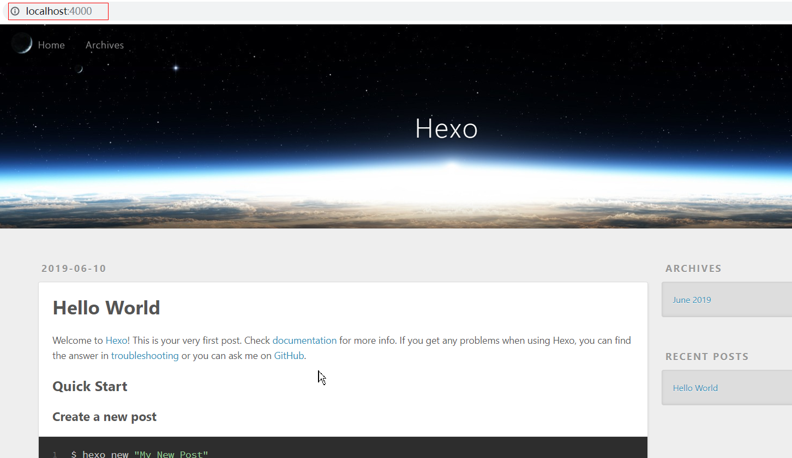
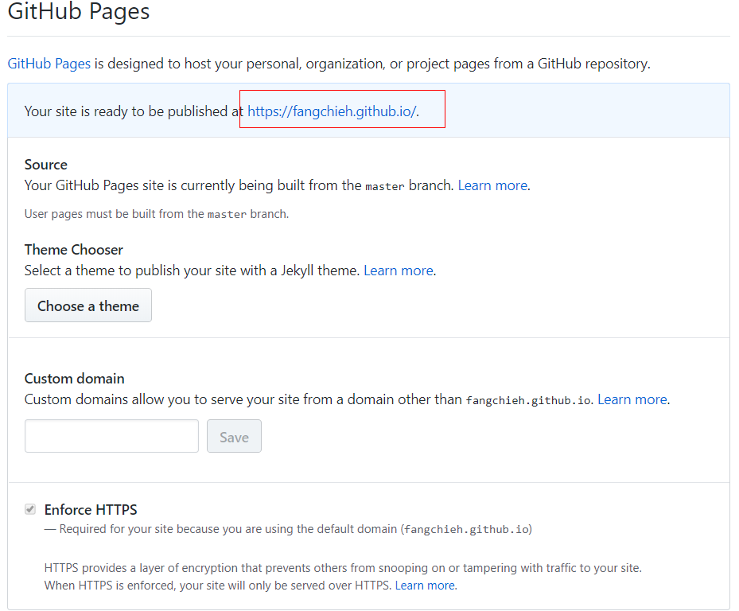
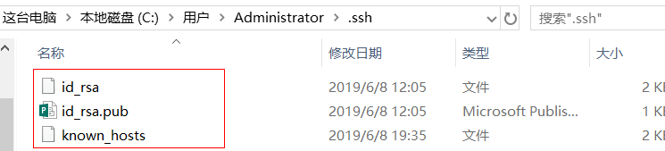
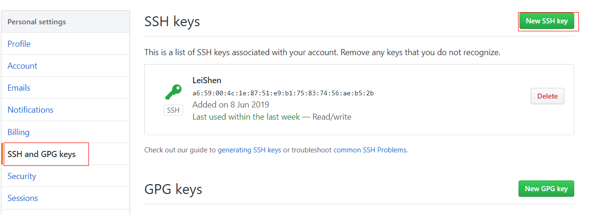
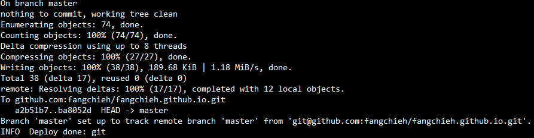
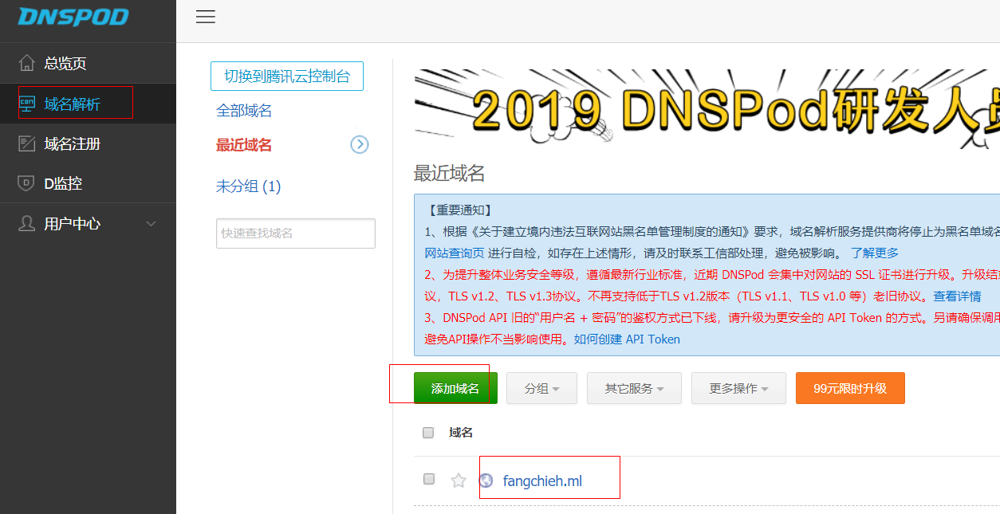
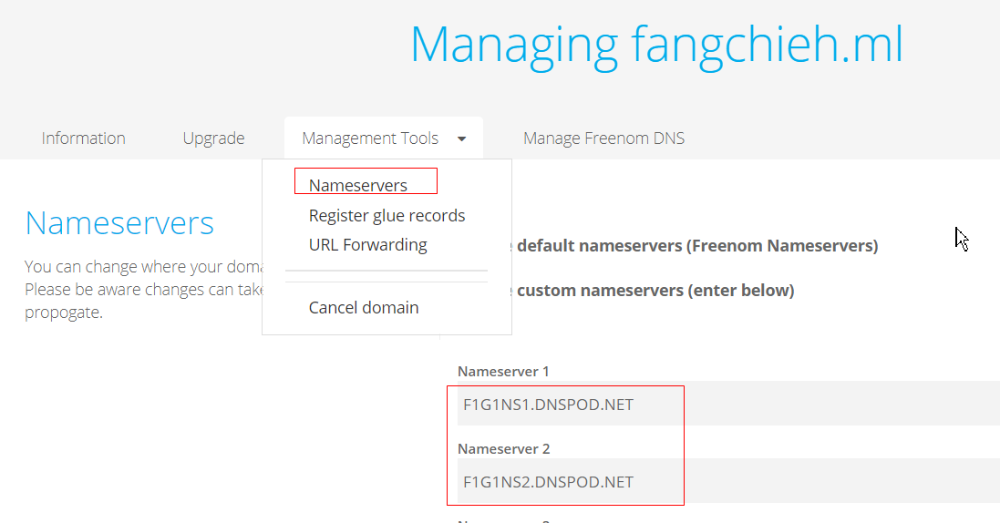
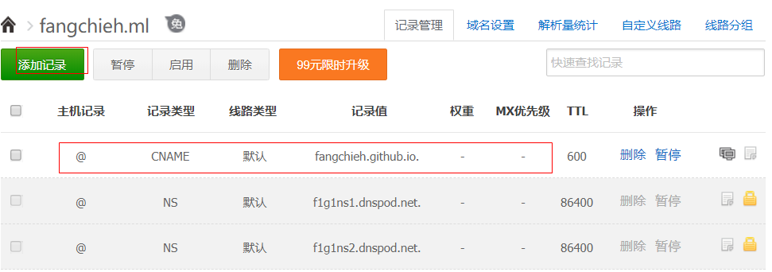

#### 1. Windows下安装Hexo

Hexo安装前需要环境:

- <a href="https://git-scm.com/download/win">Git</a>
- <a href="https://nodejs.org/dist/v10.16.0/node-v10.16.0-x64.msi">Node.js</a>

安装完成后，即在git bash可使用 npm 安装 Hexo。

```bash
$ npm install -g hexo-cli
```

安装 Hexo 完成后，请执行下列命令，Hexo 将会在指定文件夹中新建所需要的文件。

```bash
$ hexo init <folder>
$ cd <folder>
$ npm install
```

新建完成后，指定文件夹的目录如下：

```bash
.
├── _config.yml   网站的配置信息
├── package.json  应用程序的信息
├── scaffolds     模版文件夹
├── source        存放用户资源
|   ├── _drafts	  
|   └── _posts
└── themes		  主题文件夹。Hexo 会根据主题来生成静态页面。
```

```bash
$ hexo server  
```

打开hexo的服务，在浏览器输入localhost:4000就可以看到你生成的博客了。




#### 2. Github账户注册和新建项目

1. 注册Github账户
2. 新建项目,项目名必须要遵守格式：账户名.github.io
3. 在项目 "账户名.github.io" 的设置 (Settings)里开启 **GitHub Pages** 服务



#### 3. 生成SSH添加到GitHub

- 设置Git的user name和email


```bash
$ git config --global user.name "Github用户名"
$ git config --global user.email "Github邮箱"
```

- 生成SSH密钥  一路回车即可

```bash
$ ssh-keygen -t rsa -C "Github邮箱"
```



- 将`id_rsa.pub`里面的信息复制到Github的SSH keys




- 在gitbash中，查看是否成功

```bash
$ ssh -T git@github.com
```

#### 4. 将hexo部署到GitHub

- 打开站点配置文件 `_config.yml` ,设置为

```yml
deploy:
type: git
repo: https://github.com/YourgithubName/YourgithubName.github.io.git
branch: master
```

- 安装deploy-git 

```bash
$ npm install hexo-deployer-git --save
```

- 部署到Github Page

```bash
$ hexo clean        清除了之前生成的文件，也可不加
$ hexo generate     生成静态文章，可以用 hexo g 缩写
$ hexo deploy       部署文章，可以用 hexo d 缩写
或
$ hexo clean&&hexo g&&hexo d   三个命令依序一次执行
```

<font color="red">注意:</font>  deploy时可能要你输入username和password。

得到下图就说明部署成功了，过一会儿就可以在`http://yourname.github.io` 这个网站看到你的博客了！！!



#### 5. 设置个人域名

- 申请免费域名(钱多的可撒币)

  在[freenom](https://www.freenom.com/zh/index.html?lang=zh)注册登录即可申请多个免费域名(有效期一年,可免费续期)  

- 在DNSPod中添加域名解析 (下面的步骤注意替换)



- 将解析后的两条NS记录加入到 freenom Nameservers



- 在DNSPod中为你的域名添加记录

  注意:  记录类型必须是CNAME类型 : 将域名指向另一个域名，再由另一个域名提供ip地址

  其中 主机记录为 @ 则直接指向 fangchieh.ml

  　　　　　　　  xxx 则 指向  xxx.fangchieh.ml 



- 根据记录添加CNAME文件

  添加位置: 博客根文件夹下的source下 添加文件名为 CNAME (名字必须一致,无文件扩展名)

  添加内容:  fangchieh.ml        (主机记录为 @ )

  　　　　   xxx.fangchieh.ml  (主机记录为 xxx )

- 最后，在gitbash中重新部署到Github，输入

```bash
$ hexo clean&&hexo g&&hexo d
```

过不了多久，在浏览器中，输入你自己的域名，就可以看到搭建的网站啦！