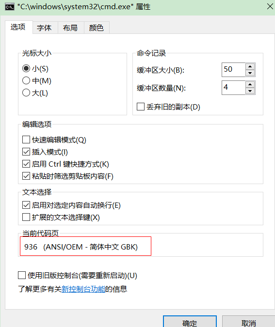
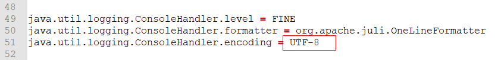
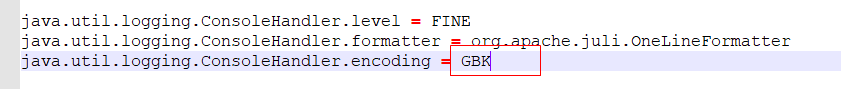
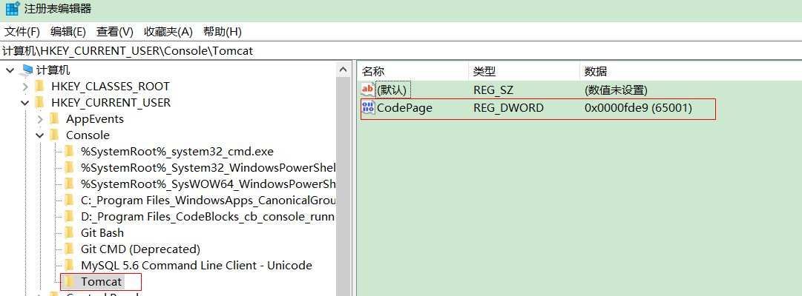
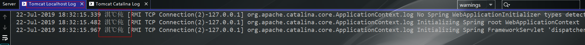
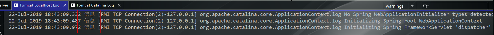

#### Tomcat控制台乱码原因：

​		Windows 的控制台默认是GBK编码的，而Toncat安装目录下的conf/logging.properties文件中的输出日志编码是UTF-8；





**解决方法：**

1. 将Tom安装目录下的conf/logging.properties文件中的输出日志编码改为**GBK**;

   

2. 只将Tomcat控制台的编码改为UTF-8

   第一步：Windows+R打开运行，输入regedit进入注册表编辑器

   第二步：在HKEY_CURRENT_USER→Console→Tomcat中修改CodePage为十进制的65001

   注意：如果没有Tomcat或者CodePage，直接新建一个，如下图所示

   也可以直接复制下面的代码，保存为.bat文件后，直接运行，即可修改成UTF-8。

   ```shell
   set rr="HKCU\Console\Tomcat"
   reg add %rr% /v "CodePage" /t REG_DWORD /d 0x0000fde9 /f>nul
   ```

#### IDEA控制台乱码解决

乱码情况：



**解决方法：**

​		进入Help→Edit custom VM options 打开idea64.exe.vmoptions文件追加

```
-Dfile.encoding=UTF-8
```

重启IDEA

